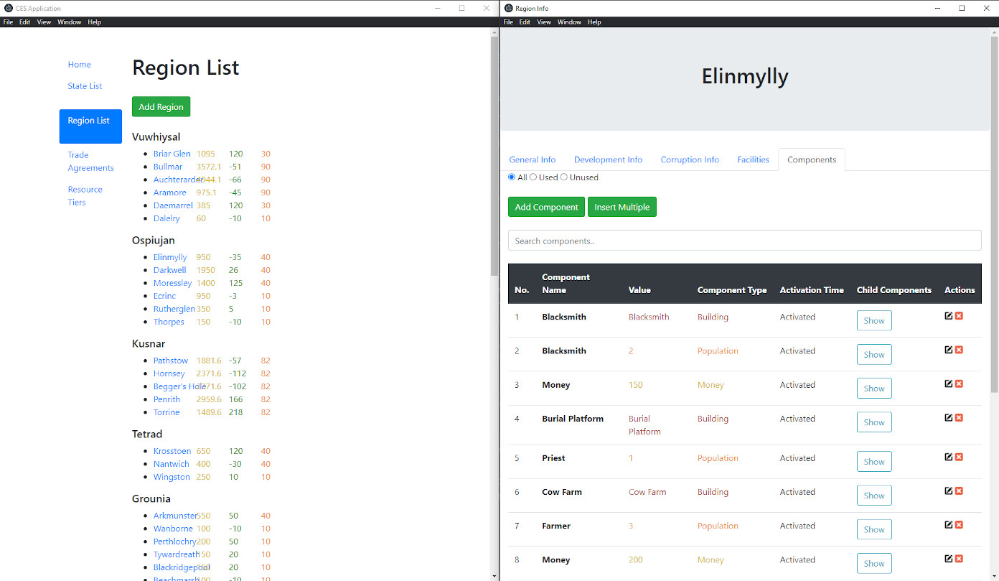

# CES Manager

> An Electron app to manage 7GCraft's ClanCraft CES

# Why

The creation of an economic system for ClanCraft was one of the most important steps in the development of ClanCraft. But as ClanCraft developed, there were more and more states and players. What once was an economy that was easily managed by a single person has become a large web of interconnected pieces and detailed calculations, one that no single person can hope to manage and calculate on their own.

The ClanCraft Division of the 7GCraft Server Operations designed a new economic system to replace the old State Economic System (SES) line, the Component Economic System (CES). and an app was conceived that could automate the process of seasonal calculations, by far the heaviest of the economic calculations. And thus was born the CES Manager app.

<!-- # Building the Latest Version
1. Pull the latest changes from the `production` branch
2. Open a command-line interpreter of your choice (e.g. Windows' cmd) and run the following command:

   `npx electron-packager ./ CES Application alpha-x.x.x --platform=win32 --arch=x64 --app-version=x.x.x`

   Be sure to replace the `x` with the proper version numbers. Here's an example for version alpha-0.1.3:
   
   `npx electron-packager ./ CES Application alpha-0.1.3 --platform=win32 --arch=x64 --app-version=0.1.3`
3. Run `CES.exe`

# Setting Up For Development
1. This project requires Node.js. If you don't have it, please download it from [here](https://nodejs.org/en/download/). This project was used at the latest with Node.js 14.5.4.
2. Clone this repository.
3. Using the command-line interpreter of your choice, navigate to the downloaded directory.
4. Run `npm ci` to download its dependencies.
 -->
